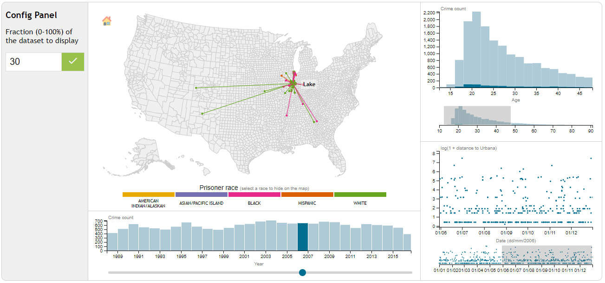

#  Visualization of Urbana crimes using D3.js

##  How to preprocess data
For preprocessing *Urbana crimes* dataset, a js script was used. To run it you'll need to install node along with its packet manager npm. Once you've done this, assure that you're in the root folder of the project and simply type in a terminal `npm install` and then `node js/data-cleansing.js`.

What the script does is simply selecting only the fields that are used for the project (prisoner home city, prisoner race, prisoner age at arrest and crime date) and then asserting that each of these fields contains valid information. If any of these fields contains invalid information, the whole record is discarded.

The most costly task is checking if the prisoner home city (state name, city name and coordinate) is valid. For this, the script uses the given coordinate to find out which state and city a criminal occurrence belongs. This asserts consistency between all occurrences.

The script may take several minutes to finish and an iteration count is displayed every 1000 completed iterations. The script finishes after about 180k iterations. Once it's completed, a preprocessed version of the dataset is put in the folder *data* under the name `urbana-crimes-preprocessed.json`.

**Important**: you don't need to preprocess data to run this project because I've already provided a preprocessed dataset in the *data* folder. I described the process so that you can check if it works properly.

##  How to run the project
This project was developed and tested on a Linux environment so it's strongly recommended to evaluate it in similar conditions. 

While in the root folder of the project, type in a terminal `python -m http.server` to serve the project files through a simple http server. Then open the link `http:localhost:8000` in your browser (preferably chrome or firefox).

If everything worked properly you should now see the visualization after it's completely loaded.

## Visualization layout
In the left side of the visualization you should see a configuration panel where you can adjust the following parameters:

- fraction of the size of the dataset: here you can choose the amount of data you want to be displayed. This options was added so that the visualization doesn't crash depending on your computer performance. You can choose a fraction between 0% and 100% and then click on the button with the check icon to apply the changes. Every time you press the button a random portion of the dataset will be chosen. This option defaults to 10%. **Note**: it may take a few seconds for the visualization to change.

On the right side of the config panel you should see the USA map along with Alaska and Hawaii. Each prisoner home city is pictured on the map as a circle and a link between this city and Urbana center as a line. The colors represent the prisoner race as described in the legend below. You can interact with the legend clicking on a prisoner race to toggle between showing or not the crimes related to the selected race.

The map has zoom and pan interactivities through the use of the mouse. Use the drag action to pan and the scroll action to zoom. When hovering over the cities on the map, their names are displayed in tooltips. When hovering over lines, their stroke width is increased.

Below the map there's a timeline histogram view where you can select a year using the slider and have all the other charts (map, bar graph histogram and scatter plot) updated accordingly.

On the far right side there's a bar graph histogram on the top and a scatter plot on the bottom. The bar graph histogram describes the age distribution of all crimes along with the age distribution of crimes in the selected year for comparison.  The scatter plot shows the distribution of when the crime occured and the distance to Urbana. Both plots have a brush that you can use to filter the points and links on the map and also to focus in each plot.

